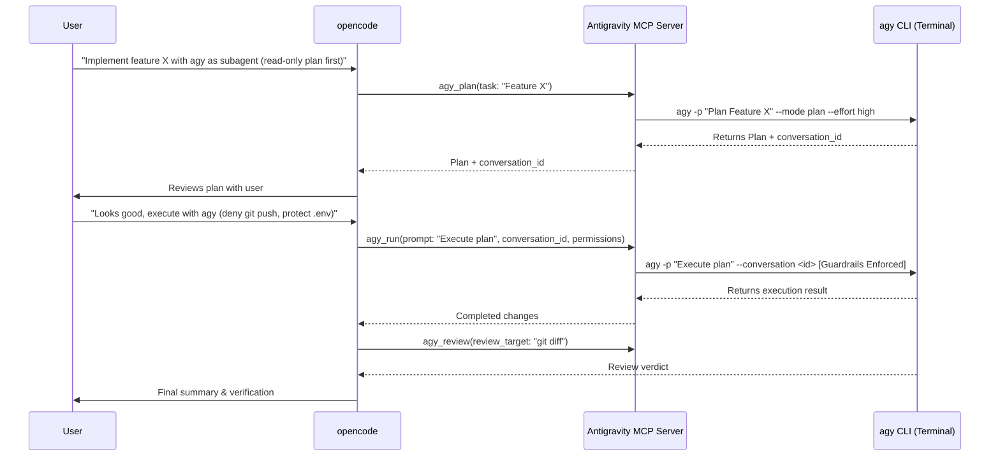

# Antigravity Subagent Skill

This skill teaches opencode how to collaborate with **Google Antigravity CLI (`agy`)** as a complementary autonomous subagent and pair-programming partner.

## Overview

Antigravity (`agy`) is Google's terminal-based AI development agent powered by Gemini models (Gemini 3.8 / 3.7 Flash, 3.1 Pro) with extended reasoning capabilities. It has native terminal access, code editing capabilities, background task management, and workspace discovery.

By pairing opencode and Antigravity:
- **opencode** acts as the primary orchestrator, interactive driver, or pair programmer.
- **Antigravity (`agy`)** acts as an autonomous subagent for deep reasoning, architectural planning, second opinions, and independent verification.

## When to Delegate to Antigravity

Delegate tasks to Antigravity when:
1. **Architectural Planning**: The task is complex and benefits from a high-effort reasoning breakdown (`agy_plan`).
2. **Autonomous Implementation / TDD**: You want a self-contained feature, refactoring, or test suite implemented end-to-end (`agy_run`).
3. **Adversarial Code Review / Sanity Check**: After modifying code, ask Antigravity to review the diff against project guidelines (`agy_review`).
4. **Rigorous Audit with a Blocking Verdict**: When a plain review is not strict enough — verifying an implementation against the plan it was supposed to follow, or a proposed plan against the real codebase (`agy_audit`).
5. **Second Opinion on Tricky Bugs**: When troubleshooting a puzzling bug or flaky test, delegate an investigation to Antigravity with a fresh perspective.
6. **Session Documentation & Anti-Compaction**: When the conversation gets long or at the end of a session, generate a structured markdown summary (`agy_session_summary`).
7. **Deep Web Research**: When comprehensive live information with cited sources is required (`agy_research`, or `/lagrange/research`).
8. **Spoken Status Updates**: When the user wants to *hear* what happened instead of reading it, or asks which voices are installed (`agy_narrate`, `agy_narrate_voices`).
9. **Real-Time Voice Conversation**: Backing a live spoken session ("Modo Charla") with a persistent, streaming `agy` process (`agy_voice_stream`). Normally driven by the `voice-chat/` scripts, not called by hand.
10. **Mobile Notifications & Approvals**: Pushing a notification, asking a blocking question, or sending a voice note to the user's phone (`telegram_notify`, `telegram_ask`, `telegram_send_voice`).

## Tool Reference

### 1. `lagrange_agy_run`
Run an autonomous Antigravity session.

When `cwd` is explicit, Lagrange resolves it to an absolute path, uses it for the agy process, and instructs `run_command` to pass that path as its default `Cwd` (or a subdirectory when needed) without prepending `cd`. This is model guidance, not filesystem confinement. The execution footer labels it **Requested Working Directory**; it is not a verified observation of every inner command.

```json
{
  "prompt": "Implement the missing test cases in src/lib/__tests__/date-contract.test.ts. Run 'npm test' to verify and fix any failures.",
  "model": "gemini-3.8-flash",
  "effort": "high",
  "permissions": {
    "allow": ["read", "edit", "commands"],
    "deny": ["network"],
    "deny_paths": [".env*", "**/*.key"],
    "deny_commands": ["git push*", "npm publish*"],
    "sandbox": false
  },
  "dangerously_skip_permissions": true
}
```

**Granular Permissions Policy:**
- `allow`: Capabilities permitted (`read`, `edit`, `commands`, `network`).
- `deny`: Capabilities forbidden (e.g. `deny: ["edit"]` switches to `--mode plan` and tells the model not to edit). Every deny is a prompt guardrail, not a barrier: agy runs with `--dangerously-skip-permissions`.
- `deny_paths`: File/directory patterns that Antigravity is strictly forbidden from accessing or editing.
- `deny_commands`: Command patterns that Antigravity is strictly forbidden from executing.
- `sandbox`: Enables Antigravity's terminal sandbox restrictions (`--sandbox`).

**Multi-Turn Threading:**
`agy_run` returns a `conversation_id`. To continue the same thread in a follow-up step:
```json
{
  "prompt": "Now also update the documentation in docs/architecture.md to reflect the new test cases.",
  "conversation_id": "94e7260d-51bb-478b-96ac-092525396df8"
}
```

### 2. `lagrange_agy_plan`
Produce a comprehensive implementation plan without making edits. The model is asked not to edit; nothing enforces it, so check the working-tree report at the end of the output.

```json
{
  "task": "Migrate legacy button classes to Radix UI across src/components/finance.",
  "model": "gemini-3.1-pro",
  "effort": "high"
}
```

Pass `conversation_id` to refine an existing plan, still in plan mode. To *execute* the plan instead, hand the same ID to `agy_run`.

### 3. `lagrange_agy_review`
Perform a thorough code review of recent changes. The model is asked not to edit; nothing enforces it, so check the working-tree report at the end of the output.

```json
{
  "review_target": "git diff HEAD~1",
  "guidelines": "Verify compliance with AGENTS.md, WCAG accessibility rules, and TypeScript strict checks."
}
```

### 4. `lagrange_agy_audit`
Run a skeptical, evidence-based audit. Much heavier than `agy_review`: it returns a BLOCKER / MAJOR / MINOR / NOTE finding rubric and a deterministic FAIL / PASS WITH RESERVATIONS / PASS verdict. 25-minute default timeout. It is asked not to edit, but audits have run the test suite and written files into the audited tree anyway (SEC-020): read the working-tree report at the end of its output before committing.

```json
{
  "target": "git diff main..HEAD",
  "audit_mode": "implementation",
  "plan": "R1: add rate limiting to /api/login. R2: return 429 with Retry-After. R3: cover both in tests.",
  "effort": "high"
}
```

Two modes:
- `"implementation"` (default) — does the code satisfy the `plan` it was supposed to follow, no more and no less?
- `"plan"` — does the proposed plan in `target` fit the flows, data model, and conventions that already exist in the repo? Includes an explicit over-engineering check.

### 5. `lagrange_agy_research`
Deep web research using Gemini's native search tools. Returns a structured report: Summary, Key Findings, Sources (with URLs), and Relevance to Current Project. Asked not to edit (not enforced), 20-minute default timeout.

```json
{
  "topic": "Breaking changes in the Claude Code plugin manifest schema",
  "recency": "past 6 months",
  "effort": "high"
}
```

Requires the `network` capability. If `network` is denied — or simply missing from `allow` — the tool returns an error instead of a report. Relay that error to the user; do not re-run the question through `agy_run`, and do not answer it from memory. A research report is only worth anything if its citations were actually fetched.

### 6. `lagrange_agy_usage`
Display session token telemetry (input, output, thinking, cache read), context window saturation, active model limits, and quota status. Pass `reset: true` to clear session counters.

### 7. `lagrange_agy_status`
Check CLI path, version, active model/effort defaults, and active ALLOW/DENY permission policies.

### 8. `lagrange_agy_set_config`
Persist defaults for model, effort, or ALLOW/DENY policies in `~/.claude/antigravity.json` or `.claude/antigravity.json`.

```json
{
  "model": "gemini-3.8-flash",
  "effort": "high",
  "permissions": {
    "deny_paths": [".env*", "**/*.key", "**/*.pem"],
    "deny_commands": ["git push*", "npm publish*"]
  },
  "scope": "project"
}
```

### 9. `lagrange_agy_session_summary`
Read Claude Code's session JSONL log, preprocess turns to filter noise, and generate a structured markdown summary using Gemini. Solves context compaction degradation.

```json
{
  "focus": "full",
  "model": "gemini-3.8-flash",
  "effort": "high"
}
```
Available focuses: `"full"`, `"decisions"`, `"changes"`, `"debugging"`. Summaries are saved to `~/.claude/session-summaries/<date>-<session-id>.md`.

### 10. `lagrange_agy_narrate` / `agy_say` / `agy_narrate_voices`

Two speaking tools, and the difference is **who writes the words**:

- **`agy_narrate` — you have nothing to say yet.** It takes no text. The plugin reads the session log itself, has Gemini draft a 2-3 sentence update, and sends it to Voicebox. Costs **zero Claude tokens**, because Claude never writes the script. This is the one for "narrate what just happened" / "cuéntame cómo fue".
- **`agy_say` — you already have the exact message.** Pass it in `text`. Use it for anything you composed yourself: a heads-up, an answer, a warning, a line the user dictated.

Picking the wrong one is the common failure: calling `agy_narrate` when the user asked you to say a *specific* sentence makes it ignore that sentence entirely and narrate the session instead.

`agy_say` sanitizes locally and instantly — markdown, code blocks, file paths, URLs and emoji come out (they are unlistenable), and anything shaped like a secret is redacted before it is spoken or sent to Telegram. Add `polish: true` only when the text was written to be *read* rather than heard — a raw log, long output, dense notes. That costs an agy round-trip of a few seconds, so leave it off for a sentence you already phrased conversationally.

`agy_narrate_voices` performs read-only discovery: it reports live or cached profiles, setup state, languages, and service health without starting providers or loading models.

For both: an explicit `voice` is one-shot consent for that acoustic profile. If omitted, selection comes only from configured `voice_setup`; an unconfigured install returns `text-only/setup_required` and preserves the text. `soul` selects identity independently and is never inferred from the voice profile. `send_telegram` is on by default so audio—or preserved text when audio is unavailable—also reaches the phone, and `local_playback` is off by default.

### 11. `lagrange_agy_voice_stream`
Backs the Real-Time Voice Mode ("Modo Charla") by keeping one long-lived streaming `agy` process alive across turns, instead of the blocking one-shot `agy_run` uses. Actions: `start`, `send`, `drain`, `status`, `stop`.

This is normally driven by the `voice-chat/` scripts (`text_loop.py`, `voice_loop.py`), which require either `--voice` or configured `voice_setup` before starting providers/microphone. `--soul` is independent. The scripts poll `drain` in a loop and pipe sentences to TTS. Do not call it by hand during a normal opencode session unless the user explicitly asks to drive a voice session manually — and if you start one, always `stop` it, since the `agy` process outlives the tool call.

### 12. `telegram_notify` / `telegram_ask` / `telegram_send_voice`
Reach the user on their phone via the Telegram bridge. `telegram_notify` pushes a message (optionally attaching a file); `telegram_ask` asks a question with tappable buttons and **blocks until they answer or it times out** (default 300s), returning their choice; `telegram_send_voice` sends an audio file as a native voice note.

Requires `TELEGRAM_BOT_TOKEN` and `ALLOWED_USER_IDS` in a `.env` at the installed plugin root — if unconfigured these fail with a setup message rather than silently. Use `telegram_ask` only for decisions genuinely worth interrupting someone's phone for (a destructive migration, a deploy), not routine confirmations.

## Collaboration Workflow


